# Amazon Redshift Devops

## Overview
CI/CD in the context of application development is a well understood topic, and there are numerous patterns and tools that developers can use to build their pipelines to handle the build, test, deploy cycle once a new commit gets into version control. For data, schema or stored procedure changes directly related to the application, typically this is part of a code base and is included in the code repository of the application. These changes are then applied when the application gets deployed to the test/prod environment. 

This blog post will demonstrate how the same set of approaches can be applied to stored procedures, DML (data manipulation language) and schema changes to data warehouses like Amazon Redshift. In addition, database migrations and tests require connection information to the relevant Amazon Redshift cluster, we will be demonstrating how this can be integrated securely using AWS Secrets Manager.

Stored procedures are considered code and as such should undergo the same rigour as application code. This means that the pipeline should involve running test against changes to make sure that no regressions are introduced to the production environment. Lastly, since we’re automating the deployment of both stored procedures and schema changes, this significantly reduces inconsistencies in between environments.

## Proposed Architecture
Open-source deployment and deployment using CI/CD tool Jenkins and Docker. Docker container will be used to build redshift pipeline to deploy DDL/DML changes.  When a code change is pushed by developer into Git, webhooks trigger a build process in Jenkins. The build job is a pipeline (descriptive/scripted) , builds the docker image (based on docker config provided) and pushes the image into docker hub. Jenkins pipeline pulls the dockerhub image and deploys that as a container executing the pipeline to run DDL/DML statements.

## Running the Redshift pipeline
CI/CD tool executes a program in the GitHub repo for code deployment. Jenkins calls the python program python_client_redshift_ephemeral.py, it reads two config (.ini) files. First file,dw_config.ini contains cluster configuration. Second file, query_redshift_api.ini contains the SQL (DDL/DML/stored procedure) to be executed. 

You can see how all of these works together by doing the following steps:

### Clone the GitHub Repository
The AWS CloudFormation template and the source code for the example application can be found here: https://github.com/aws-samples/devops-redshift.git . Before you get started, you need to clone the repository using the following command:

`git clone https://github.com/aws-samples/devops-redshift.git`

This will create a new folder, redshift_devops, with the files inside. 

### Deploy CloudFormation Template
Go to the CloudFormation console and click "Create Stack" then choose "With new resources (standard)". 

Once you're in the "Create stack" page, choose "Upload a template file" and then "Choose file". The file should be in `<cloned_directory>/cloudformation_Redshift_devops.yml`. After you select the file, your screen should look like the following:

Click "Next" and complete the following parameters:
-	Stack name – we will use `RedshiftDevOps`
-	DataBucketName – S3 bucket name
-	Key – Your pem key to connect to ec2 instance.
-	Master user name
-	Master password for both test and prod Amazon Redshift clusters. The password has the following criteria:
    * Must be 8-64 characters.
    * Must contain at least one uppercase letter.
    * Must contain at least one lowercase letter.
    * Must contain at least one number.
    * Can only contain ASCII characters (ASCII codes 33-126), except ' (single quotation mark), " (double quotation mark), /, \, or @.
-	Redshift node count (default:dsc2 – 1 node) 
-	Your public IP

Click "Next"

We can leave everything as is in this page and click "Next".

Lastly, scroll to the bottom of the page and check the acknowledgement and click "Create stack". The stack will create the VPC, Amazon Redshift clusters, ec2 instance, deploy a container on ec2 running Jenkins.

Click the refresh button on the top right corner to track the progress of the stack creation.

1. Connect to ec2 instance and verify docker container is running. 

    Use SSH to log on to ec2 instance using the .pem file selected in cloud formation.

    Once logged on to ec2 instance run the command:
    
    `docker ps -a`

    

    myjenkins docker container is deployed mapping ec2 host folders with myjenkins container. This will preserve the state of Jenkins application (metadata, jobs etc.) even though container exits. If the container were to be re-started, configurations will not be lost.
      
    If the container exits for any reason, execute the following command on the terminal:

    `docker run -d -p 8080:8080 --name myjenkins -v /var/run/docker.sock:/var/run/docker.sock -v jenkins_home:/var/jenkins_home -v jenkins_downloads:/var/jenkins_home/downloads jenkins/jenkins:lts`

2. Once done, log on to Jenkins ec2url+jenkinsport
    
    Copy the URL and paste in a web browser (chrome, firefox recommended). Please note the URL will be unique to you and will be public ec2 instance name deployed by CFN. Port 8080 is used for web traffic.

    http://`ec2-34-239-162-89.compute-1.amazonaws.com`:8080/

    Log on to ec2 console and check the ec2 instance name entitled Jenkins Server

    

3. A screen asking for administrator password will be displayed.

    

    Log on to the Jenkins container using the command 

    `docker exec -it myjenkins /bin/bash`

    Once inside the container shell, execute the command:

    `cat /var/lib/jenkins/secrets/initialAdminPassword`

4. The simplest and most common way of installing plugins is through the **Manage Jenkins > Manage Plugins**. Click **Available** to view all the Jenkins plugin that can be installed. Using the search box, search for **Docker Plugin**. Select **Docker,Docker API Plugin,Docker Pipeline,docker-build-step**

    

5. Adding security credentials within Jenkins.
    
    Next, we will add credentials for accessing docker, github and AWS account. Click 
    Dashboard> Manage Jenkins> Manage Credentials > Jenkins (stores scoped t Jenkins)

    

    Click Add credential, create an id (you can create a custom id or you could use the default guid provided by Jenkins).

    

    On the “Kind” drop down box, select GithubApp define username and password click ok. Repeat the same process, for Docker. Select kind as secret text and then add, AWS secret.

6. Jenkins 2.0 allows creation of pipeline as code, as essential part of continuous delivery (CD). Declarative pipeline is groovy based, having a programming language to build pipelines avoids runtime issues with the build script. 

    On the left pane select New Item>Pipeline> "Redshift_declarative_pipeline" as the name of declarative pipeline.

    

    Provide a description for the pipeline. Select a build trigger, we will like to create a based on changes made to the git repo. Click the check box "GitHub hook trigger for GITScm polling".

    

    In the Advanced Project Options. For pipeline definition drop down select "Pipeline script from SCM". Select Git as SCM and provide the repository URL for github repo. For credentials select Github credentials added. Script path will look for the file to be used for declarative pipeline, type in name as Jenkinsfile. Click Save.

    

7. We will implement another version of pipeline by using Jenkins scripted pipeline option. You can decide to run either Declarative or scripted pipeline. Declarative pipelines are preferred as they allow pipeline to be managed as code.

    To begin, navigate to Jenkins homepage and on the left pane, select New Item>Pipeline> "redshift_devops_scripted_pipeline" as the name of scripted pipeline.

    In the advance project option, select “pipeline script” as definition. Copy contents from Jenkins_scripted_pipeline.txt into the script section. In the script, replace variable name – DOCKERRPONAME with the docker repo created and YOURDOCKERLOGON with your docker in login name. 

    Also, note that AWS_DEFAULT_REGION is set as 'us-west-2'. You can modify the region based on your preference.

    After changes have been made, click save and apply.

    

8. Navigate to your git account containing cloned devops-redshift repository and click settings. Click webhooks on the left had side pane, it should open the manage webhook window. In the payload URL, put in the Jenkins URL with /github-wehook/ URI path. 

    http://`ec2-34-239-162-89.compute-1.amazonaws.com`:8080/github-webhook/

    

    This webhook notifies Jenkins to trigger a build when there are any changes to the GitHub repository.

9. Copy and paste the below lines in the query_redshift_api.ini file 

    [DDL_v08]

    query6 = create table test_table_service (col1 varchar(10), col2 varchar(20));

    And commit the changes. 
10. Git will send an event to the Jenkins server to start the build. If all works, you should see the Jenkins job automatically triggered at this point. 

11. Once the Jenkins job has been completed you should have the container running. To check the container, navigate to terminal and run docker ps -a you should see a container rs_containerv1 running.

    

12. To verify the steps executed by the docker container , check the logs. Run

    `docker logs rs_containerv1 -f`

    to see the log lines getting generated.

13.	The process will execute test cases and print results of assertions for values specified in the results section. 

14.	Finally, log on to console -> Redshift -> clusters and you will a new cluster based on the cluster name provided in the clusterconfig.ini file. 

15.	Once all the execution steps are completed, container will show a status of EXITED(0).

    

## Redshift CI/CD using AWS services 

In this section we will implement the same CI/CD pipeline we reviewed, but will use AWS CI/CD services components. Below are the component details:

| Service Name              | Description |
| ------------------------- | ------------------------------------------ |
| [AWS CodeCommit](https://aws.amazon.com/codecommit/)        | This is the version control system where you will be storing your code       |
| [AWS CodeBuild](https://aws.amazon.com/codebuild/)        | This service will be used to build the containers to build runtime components for code execution. The file `buildspec.yml` is used to build the container image   - Prebuild: Logs on to private repository on AWS ECR (Elastic Container Repository), builds an image based on the docker file specified.   - Build: A base image of ubuntu 18.04 is pulled from docker hub, Linux packages, python 3.7 , aws cli are installed and code from repo is copied to the src directory of the container.   - Postbuild: Docker image is pushed to the ECR repository and tagged as the latest image.|
| [AWS ECS](https://aws.amazon.com/ecs/)               | A cluster is created using the AWS ECS service. A task to deploy DDL runs as a service to deploy the DDL/DML and execute test cases.  The task picks up the latest image created by CodeBuild to deploy the changes. |
| [AWS CodePipeline](https://aws.amazon.com/codepipeline/)      | Responsible for the overall orchestration from source to Redshift cluster deployment |

As you can tell from the description of the different components above, we're also using some additional dependencies at the code level, these are as follows:

| Name              | Description |
| ------------------------- | ------------------------------------------ |
| Pyunit | Open source testing framework used to execute test cases against the changes that have been deployed on the Redshift cluster.  |

In the succeeding sections, we would be diving deeper into how all of these integrate together.

### Push Code to the CodeCommit Repository

We will create a new repository redshift_devops. Navigate to AWS console> codebuild>create repository and provide the name and description on the create repository form. 

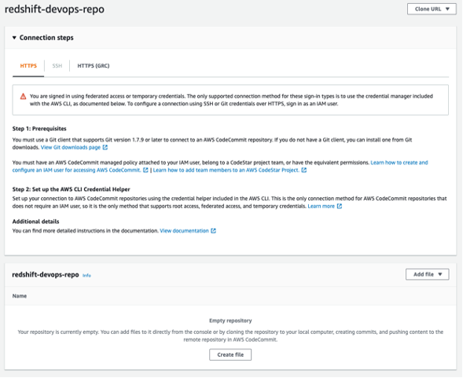

Before you can push any code into this repo you have to setup your Git credentials, follow the steps outlined in the CodeCommit [documentation](https://docs.aws.amazon.com/codecommit/latest/userguide/setting-up-gc.html) on how to do this. Once you reached Step 4, copy the HTTPS URL, and instead of cloning, we would be adding the CodeCommit repo URL into the code that we cloned earlier by doing the following steps:

`git remote add codecommit <repo_https_url> `

`git push codecommit main`

The last step will populate the repository and you can confirm it by refreshing the CodeCommit console. If you get prompted for username and password, input the Git credentials that you generated and downloaded from Step 3.

### AWS CodeBuild

Navigate to AWS console> CodeBuild and select create build project. Providing the following details:

1. Project name as redshiftdevops. 

2. Description of the build project. 

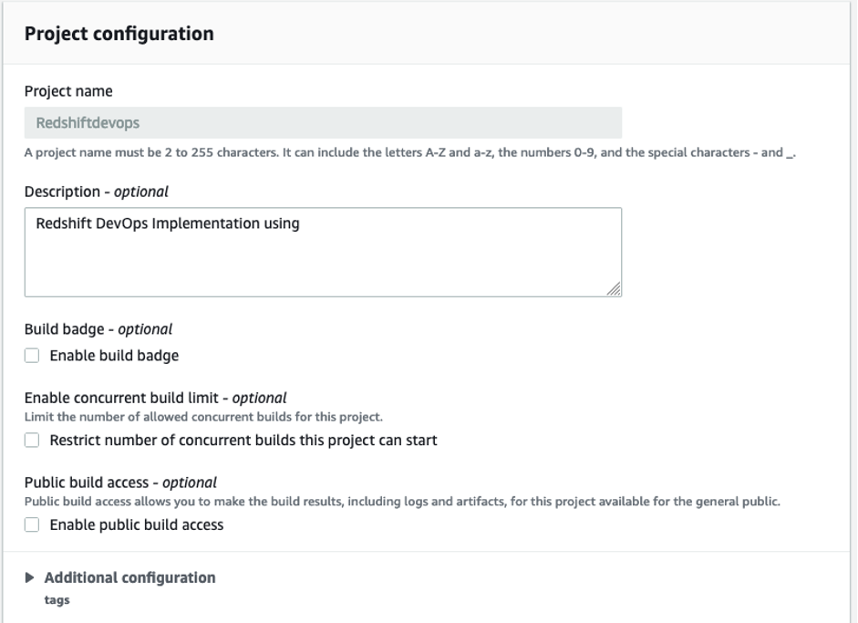

3. Source – on the drop down select AWS CodeCommit
      Name of the repository should be auto-populated, select the CodeBuild repository created in the previous step. Select the branch as master

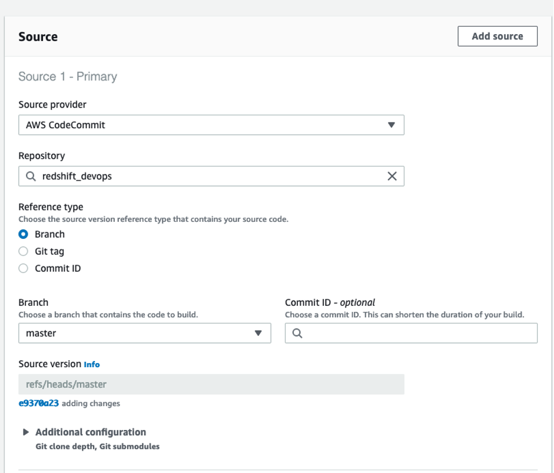

4. Environment Image – select managed image
      Operating system as Ubuntu or Amazon Linux 2
      Runtime – standard

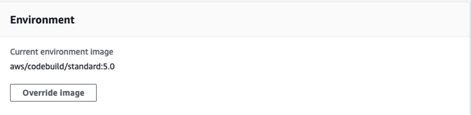

5. Service role – You can either chose to create a new service role or choose an existing service role you might have created. For IAM policy details please refer to [link](https://docs.aws.amazon.com/codebuild/latest/userguide/setting-up.html)

6. Buildspec file – AWS CodeBuild uses the buildspec.yml file to perform the pre-build, build and post-build steps. This file must be defined in the root directory of CodeCommit repo.  You can also define a custom name and location of the buildspec.yml file and provide the details. 

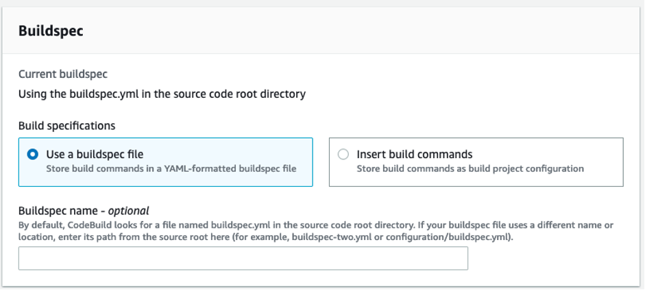

7.	Artifacts – we will not be generating any artifacts, but will be uploading the container image directly to ECR. Select the Type as No artifacts

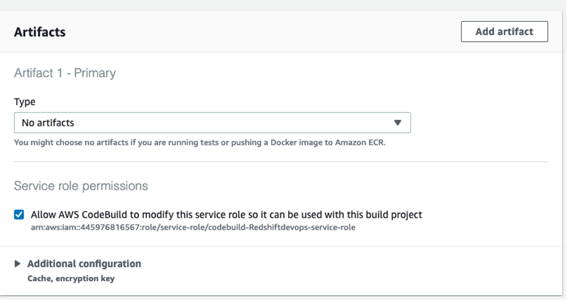

8. Logs – Add a group name and stream name to capture the logs.

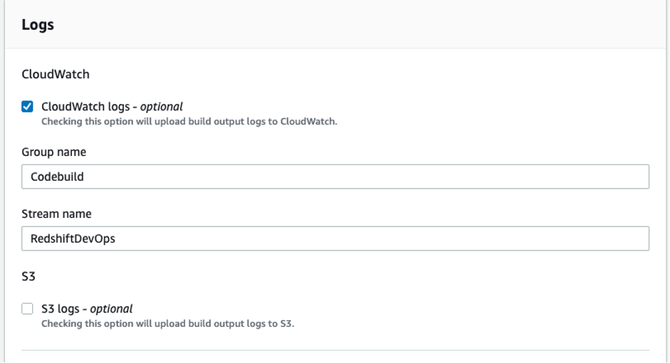

Once all the details have been provided click the "create build project button"

### AWS Elastic Container Registry (ECR)

In the next step, we will create a private ECR repo to host the build image create by AWS Build service.Navigate to ECR , AWS console > ECR.

Click create repository, select the privacy setting as private and provide a repository name. 

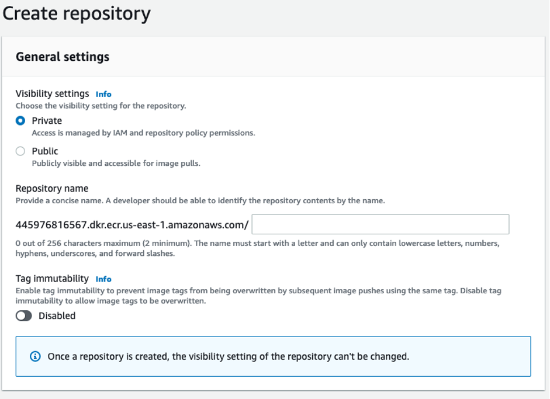

Please note that once a ECR repository has been created visibility settings cannot be changed. 

### AWS Elastic Container Service (ECS)

From AWS console navigate to ECS (Elastic container service). Click create cluster and select the option as “Networking only”, as we will be using AWS Fargate to create and manage our cluster service. Click next, provide cluster name and click create.

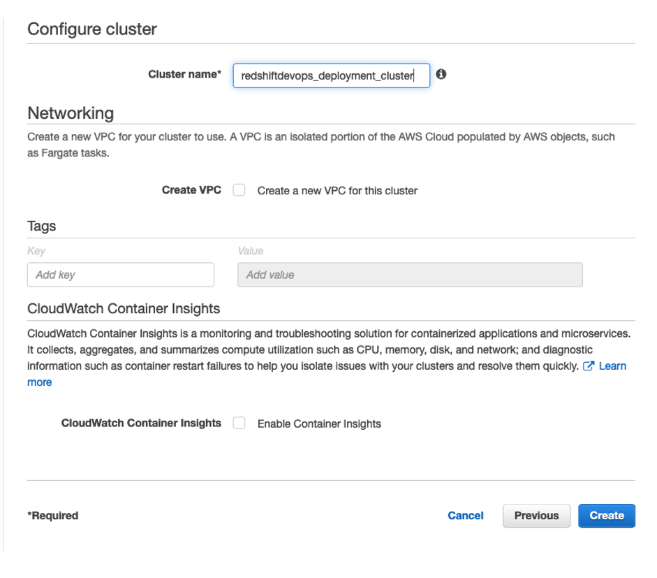

On the left hand pane, select Task Definitions, click create a new task definition. On Launch type compatibility select FARGATE and click next. This will present task and container definition screen. Provide the following details:
1.	Task definition name – Task name 
2.	Task role – The drop down should provide ecsTaskExecutionRole
3.	Operating system family - Linux
4.	Task execution role – ecsTaskExecutionRole
5.	Task memory – 2 GB 
6.	Task vCPU – 1 vCPU

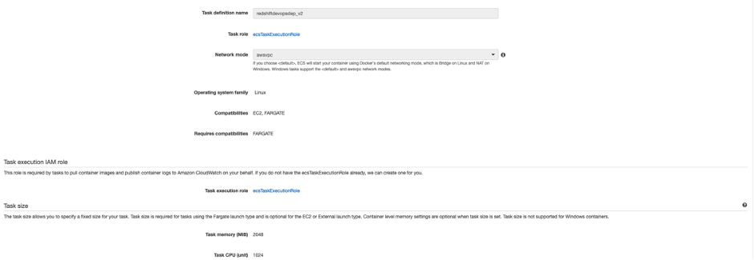

7.	Click Add Container and it would present a new screen:
    -   Container name – Name of the container running the deployment pipeline
    -   Image – URI of the private ECS repo created
         `AWSACCOUNTNUMBER.dkr.ecr.us-east-1.amazonaws.com/redshiftdevops:redshiftdevops`

        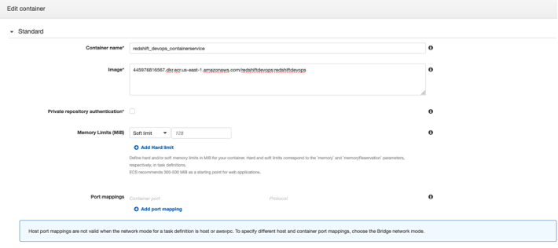
    -   CPU Units - 1
    -   Environment – Paste the following command:
          `python3,python_client_redshift_ephemeral.py,rollforward,query_redshift_api.ini,ALL,ALL,s,dw_config.ini,DEV`

        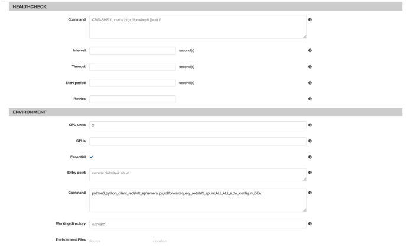
Leave the other parameter as blank and click create. This step completes the ECS cluster and task definition needed to deploy changes to Redshift database. 

8.	Select Task definitions on the left hand pane, select task created, click actions and select deploy as a service.

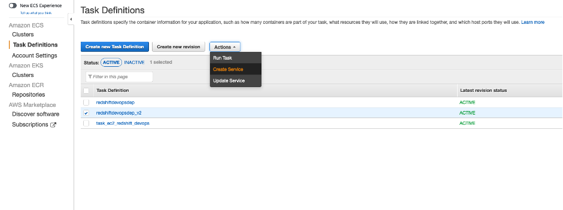

This step created the task as a continuous service, which picks up changes and deploys them to the Redshift cluster. 

### AWS CodePipeline

To bring all of these components together, we will be using CodePipeline to orchestrate the flow from source code until code deployment. There are some additional capabilities you can do with CodePipeline. For example, you can add an [Approval step](https://docs.aws.amazon.com/codepipeline/latest/userguide/approvals-action-add.html) after a code change is made for someone to review the code change and perform a build and deploy.

Navigate to CodePipeline from the console and click create pipeline. Our Pipeline will consist of two stages Add source stage and Add build stage. Provide a pipeline name and chose an existing or new IAM service to deploy the change. Click Next 

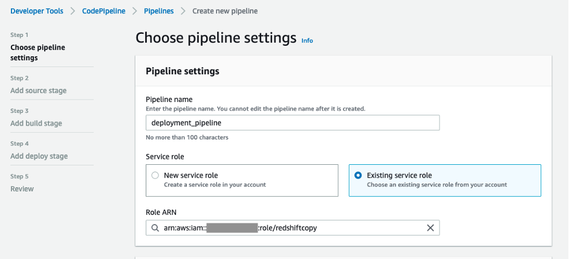

Click Next and select source provider ad AWS CodeCommit. Select repository name from the drop down and Branch name as master.

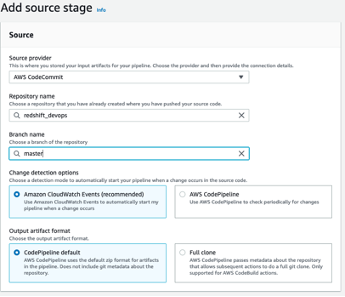

Add the build stage, by selecting code provider as AWS CodeBuild, Region and Project name. Select Build type as Single Build. Click Next and click skip deploy stage.

Review the changes and click create pipeline, this should create the pipeline needed.

### Example Scenario

Let’s take an example scenario, we would add two new queries in the redshift_query.ini file to execute on existing Redshift cluster. Copy the below lines towards the end of the file.

`[DDL_v08]`

`query6 = create table test_table_service(col1 varchar(10), col2 varchar(20));`

We will need to commit the changes by running the following commands on terminal.

`git add .`

`git commit -m "changes to query.ini file"`

`git push`

This should push the changes to the CodeCommit repository. AWS code pipeline will trigger build job , create the docker image and push it to AWS ECR.

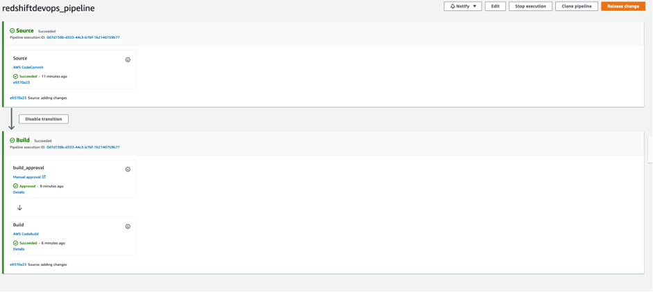

ECS service picks up all the changes and deploys it to Redshift, and the table gets created. 

## Conclusion

Using CI/CD principles in the context of Amazon Redshift stored procedures and schema changes improves reliability and repeatability of change management process. Running test cases validates database changes are providing expected output like application code. If the test cases fail, changes can be backed out with a simple rollback command. 

In addition, versioning migrations enables consistency across multiple environments and prevents issues arising from schema changes that are not applied properly. This increases confidence when changes are being made and improves development velocity as teams spend more time developing functionality rather than hunting for issues due to environment inconsistencies. 

## Security

See [CONTRIBUTING](CONTRIBUTING.md#security-issue-notifications) for more information.

## License

This library is licensed under the MIT-0 License. See the [LICENSE](LICENSE) file.
