# Overview

CI/CD in the context of application development is a well-understood
topic. Developers can use numerous patterns and tools to create
pipelines to handle build, test, and deployment cycles when a new commit
gets into version control. While there are solutions to manage
application CI/CD pipeline, managing database versioning with rollback
remains a challenge.

This blog post will demonstrate how DevOps best practices and CI/CD
principles can be applied to DDL (Data Definition Language), DML (data
manipulation language), and schema changes to a data warehouses like
Amazon Redshift. We will also examine how test cases can be executed
against changes deployed to an environment. In addition, database
migrations and tests require connection information to the relevant
Amazon Redshift cluster; we will demonstrate how this can be integrated
securely using AWS Secrets Manager.

DDL and DML are considered code and should operate at the same level of
rigor as application code. This means that the pipeline should be
involved in running tests against deployed changes to minimize
issues/challenges introduced in the production environment. Lastly,
since we\'re automating DDL and DML scripts, this helps reduce
inconsistencies between the environments.

# Proposed Architecture

We will use two deployment models for implementing this solution. In the
first model, solution is deployed using Jenkins and Docker. Docker
containers will be used to build a pipeline to a deploy DDL/DML changes.
When a developer pushes SQL code into Git, webhooks trigger a build
process in Jenkins. The job triggers a pipeline in Jenkins (both
descriptive/scripted examples are provided) that builds a docker image
(based on the docker config provided) and pushes the image into docker
hub (The image is first updated in docker hub to ensure consistency).
Jenkins pulls the docker hub image and deploys it as a container.
Finally, Jenkins executes DDL/DML within the container.

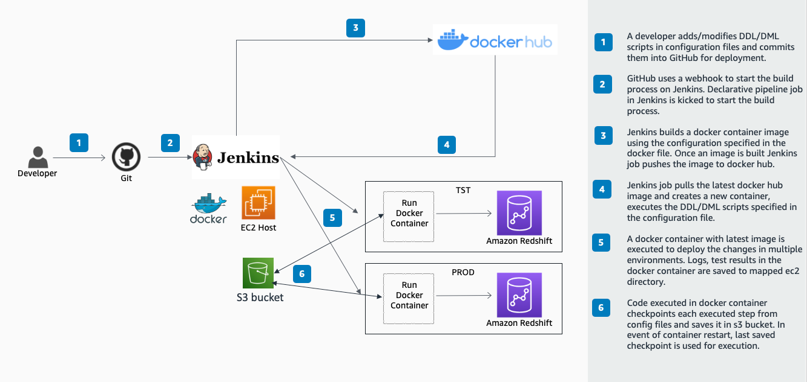{width="6.263888888888889in"
height="3.4902777777777776in"}

# Running the Redshift pipeline 

Jenkins builds a container with specifications provided in the docker
file. Jenkins then executes a docker run command, this invokes the
python program python_client_redshift_ephemeral.py, which reads two
config (.ini) files.

The first file, dw_config.ini, contains configuration for Redshift
cluster to be created . The second file, query_redshift_api.ini contains
the SQL (DDL/DML/stored procedure) to be executed.

You can see how all of these works together by doing the following
steps:

## 1. Clone the GitHub Repository

The AWS CloudFormation template and the source code for the example
application can be found here:
<https://github.com/aws-samples/devops-redshift.git> . Before you get
started, you need to clone the repository using the following command:

git clone <https://github.com/aws-samples/devops-redshift.git>

This will create a new folder, redshift_devops, with the files inside.

## 2. Deploy CloudFormation Template

Go to the CloudFormation console and click \"Create Stack,\" then choose
\"With new resources (standard).\"

Once you\'re on the \"Create stack\" page, choose \"Upload a template
file\" and then \"Choose file.\" The file should be in
\<cloned_directory\>/cloudformation_Redshift_devops.yml. After you
select the file, your screen should look like the following:

Click \"Next\" and complete the following parameters:

-   Stack name -- we will use RedshiftDevOps

-   DataBucketName -- S3 bucket name

-   Key -- Your pem key to connect to ec2 instance.

-   Master user name

-   Master password for both test and prod Amazon Redshift clusters. The
    password has the following criteria:

    -   Must be 8-64 characters.

    -   Must contain at least one uppercase letter.

    -   Must contain at least one lowercase letter.

    -   Must contain at least one number.

    -   Can only contain ASCII characters (ASCII codes 33-126), except\'
        (single quotation mark),\" (double quotation mark), /, \\, or @.

-   Redshift node count (default:dsc2 -- 1 node)

-   Your public IP

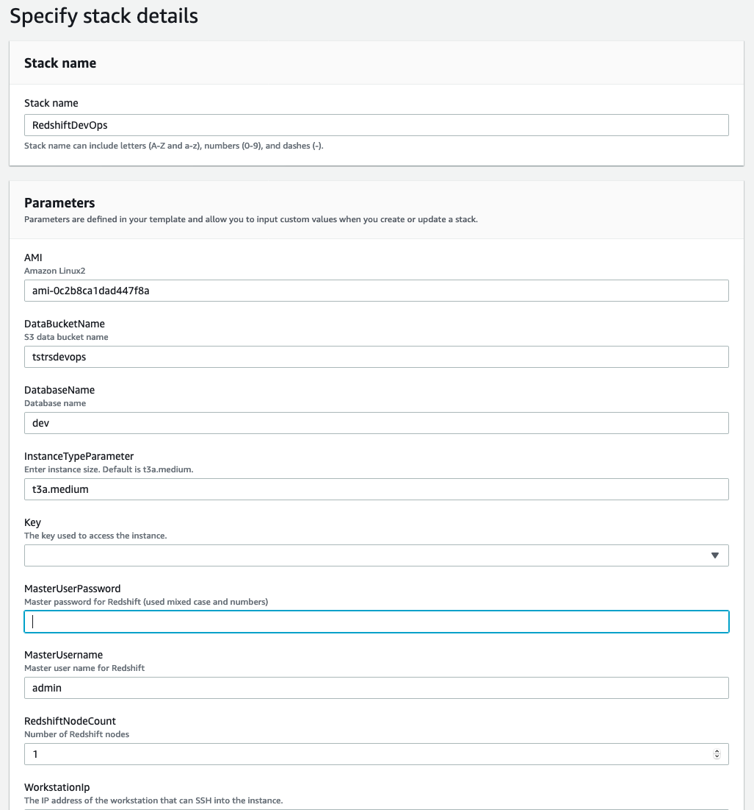{width="6.263888888888889in"
height="6.715277777777778in"}

Click \"Next\"

{width="6.263888888888889in"
height="5.59375in"}

We can leave everything as is on this page and click \"Next.\"

{width="6.263888888888889in"
height="1.5722222222222222in"}

Lastly, scroll to the bottom of the page, check the acknowledgment, and
click \"Create stack.\" The stack will create the VPC, Amazon Redshift
clusters, ec2 instance deploy a container on ec2 running Jenkins.

Click the refresh button on the top right corner to track the progress
of the stack creation.

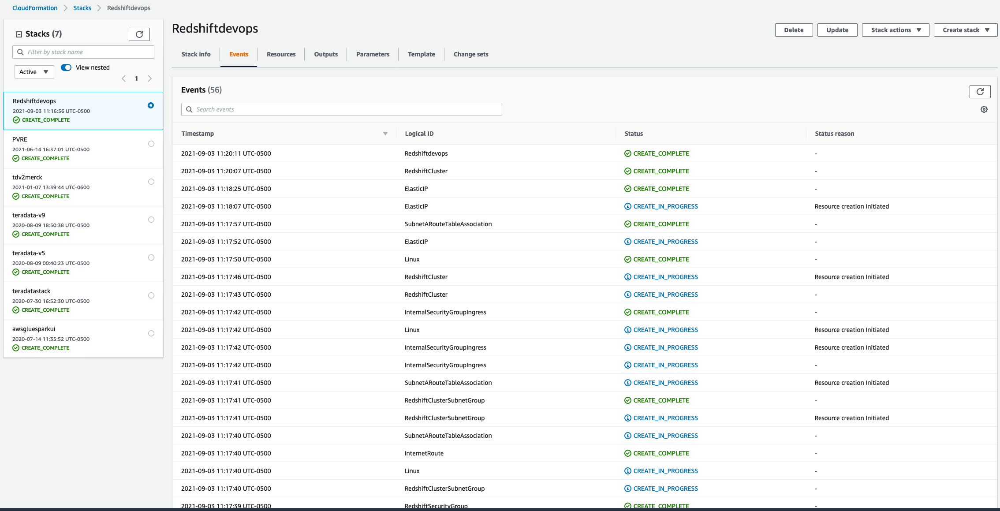{width="6.263888888888889in"
height="3.2006944444444443in"}

3\. Connect to ec2 instance and verify docker container is running.

> Use SSH to log on to the ec2 instance using the .pem file selected in
> cloud formation.
>
> Once logged on to ec2 instance, run the command:
>
> docker ps -a
>
> 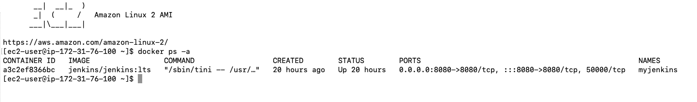{width="6.518073053368329in"
> height="1.074481627296588in"}
>
> myjenkins docker container is deployed mapping ec2 host folders with
> myjenkins container. This will preserve the state of the Jenkins
> application (metadata, jobs, etc.) even though the container exits. If
> the container were to be re-started, configurations would not be lost.

If the container exits for any reason, execute the following command on
the terminal:

> *docker run -d -p 8080:8080 \--name myjenkins -v
> /var/run/docker.sock:/var/run/docker.sock -v
> jenkins_home:/var/jenkins_home -v
> jenkins_downloads:/var/jenkins_home/downloads jenkins/jenkins:lts*

4\. Once done, log on to Jenkins ec2url+jenkinsport

> Copy the URL and paste it into a web browser (chrome, firefox
> recommended). Please note that the URL will be unique to you and a
> public ec2 instance name deployed by CFN. Port 8080 is used for web
> traffic.
>
> [http://ec2-34-239-162-89.compute-1.amazonaws.com:]{.underline}8080/

A screen asking for the administrator password will be displayed.

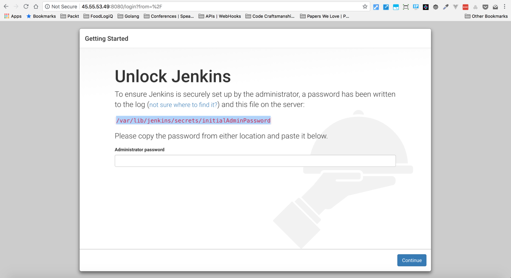{width="6.9065146544181975in"
height="3.7664238845144355in"}

Log on to the Jenkins container from terminal using the command

*docker exec -it myjenkins /bin/bash*

Once inside the container shell, execute the command:

*cat /var/lib/jenkins/secrets/initialAdminPassword*

5\. The simplest and most common way of installing plugins is through
the **Manage Jenkins** \> **Manage Plugins**. Click **Available** to
view all the Jenkins plugins that can be installed. Using the search
box, search for **Docker Plugin**. Select **Docker, Docker API Plugin,
Docker Pipeline,docker-build-step**

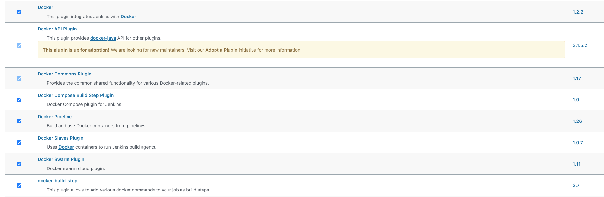{width="6.263888888888889in"
height="2.046527777777778in"}

6\. We are adding security credentials within Jenkins.

Next, we will add credentials for accessing Docker, GitHub, and AWS
accounts. Click

Dashboard\> Manage Jenkins\> Manage Credentials \> Jenkins (stores
secrets)

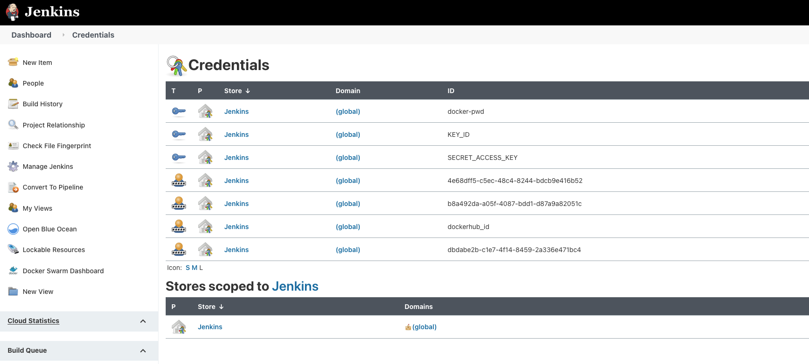{width="6.263888888888889in"
height="2.828472222222222in"}

Click Add credential, create an id (you can create a custom id, or you
could use the

default guide provided by Jenkins).

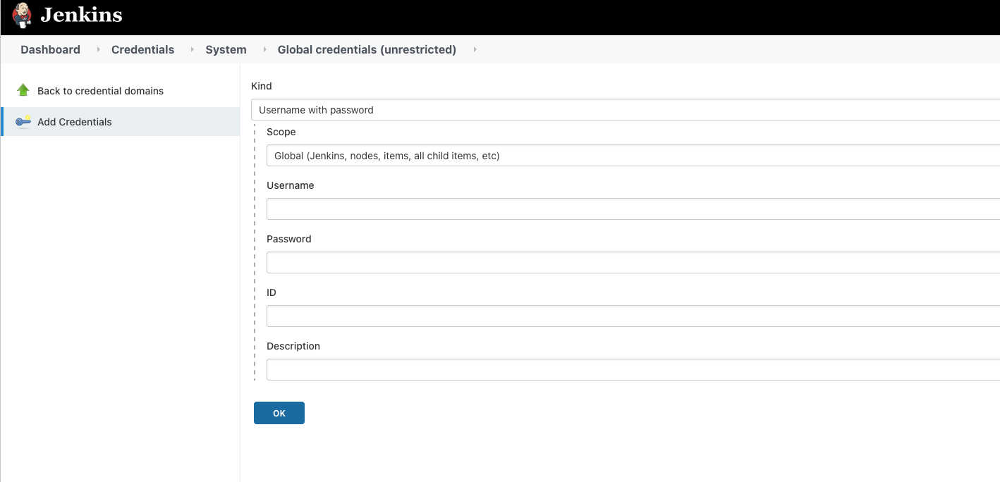{width="5.545286526684165in"
height="3.0237226596675417in"}

On the \"Kind\" drop-down box, select GithubApp define username and
password click

> ok. Repeat the same process for Docker. Select kind as secret text and
> then add AWS secret.
>
> 7\. Jenkins 2.0 allows pipeline creation as code, as an essential part
> of continuous delivery (CD). The declarative pipeline is groovy-based;
> having a programming language to build pipelines avoids runtime issues
> with the build script.

On the left pane, select New Item\>Pipeline\>
\"Redshift_declarative_pipeline\" as the name of the declarative
pipeline.

{width="6.263888888888889in"
height="4.248611111111111in"}

> Describe the pipeline. Select a build trigger; we would like to create
> a based on changes made to the git repo. Click the check box \"GitHub
> hook trigger for GITScm polling.\"
>
> 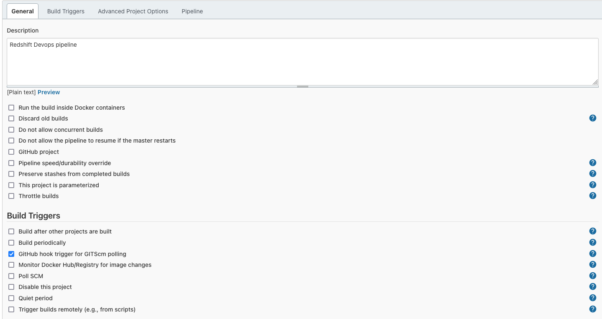{width="6.263888888888889in"
> height="3.329861111111111in"}
>
> In the Advanced Project Options. For pipeline definition drop-down,
> select \"Pipeline script from SCM.\" Script path will look for the
> file to be used for declarative pipeline, type in the name as
> Jenkinsfile. Select Git as SCM and provide the repository URL for the
> Github repo. For credentials, select Github credentials added. Click
> Save.
>
> 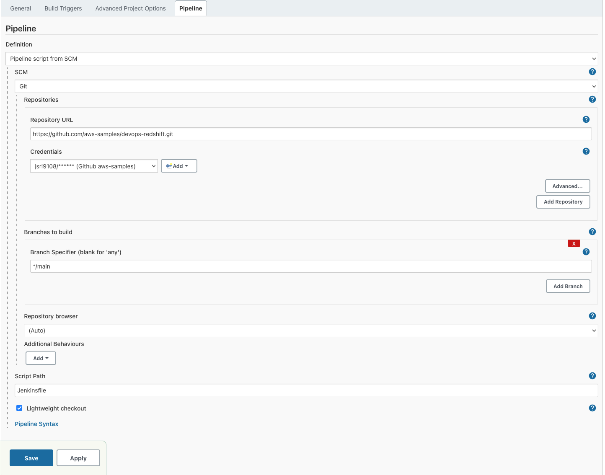{width="6.263888888888889in"
> height="4.919444444444444in"}
>
> 8\. You can decide to run either a Declarative or scripted pipeline.
> Declarative pipelines are preferred as they allow the pipeline to be
> managed as code. In this step we show, how to implement a scripted
> pipeline.

To begin, navigate to Jenkins homepage, and on the left pane, select New
Item\>Pipeline\> \"redshift_devops_scripted_pipeline\" as the name of
the scripted pipeline.

> Select \"pipeline script\" as a definition in the advance project
> option. Copy contents from Jenkins_scripted_pipeline.txt into the
> script section. In the script, replace variable name -- DOCKERRPONAME
> with the docker repo created and YOURDOCKERLOGON with your Docker in
> the login name.
>
> Also, note that AWS_DEFAULT_REGION is set as \'us-west-2\'. You can
> modify the region based on your preference.
>
> After changes have been made, click save and apply.
>
> 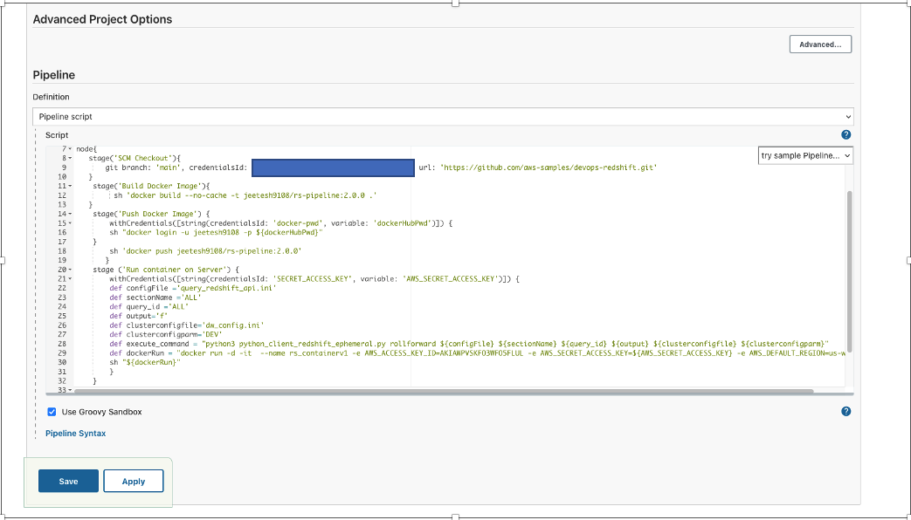{width="6.263888888888889in"
> height="3.5791666666666666in"}
>
> 9\. Navigate to your git account containing cloned DevOps-redshift
> repository and click settings. Click webhooks on the left-hand side
> pane; it should open the manage webhook window. Put the Jenkins URL
> with the/GitHub-webhook/ URI path in the payload URL.
>
> <http://ec2-34-239-162-89.compute-1.amazonaws.com:8080/github-webhook/>
>
> 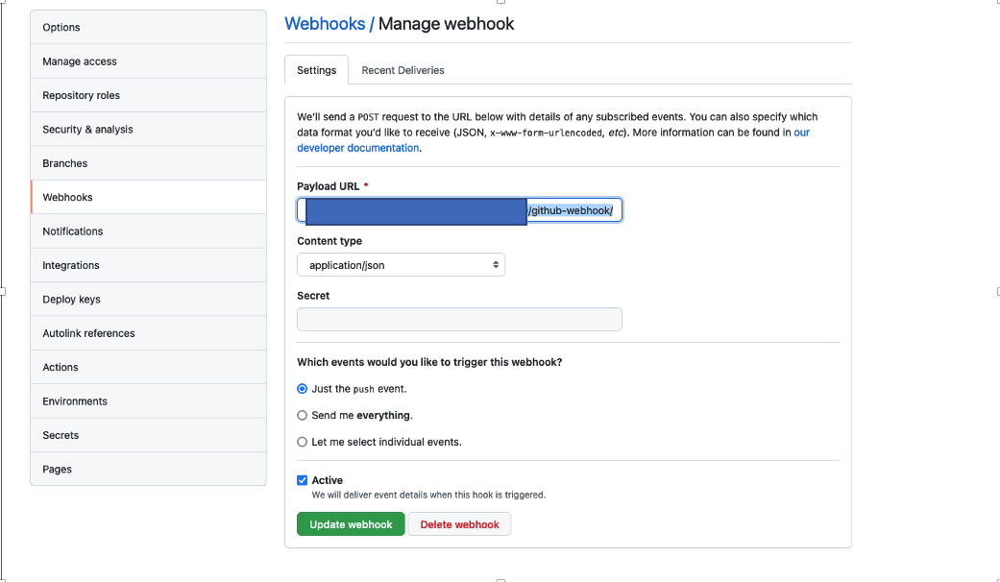{width="6.263888888888889in"
> height="3.6465277777777776in"}
>
> This webhook notifies Jenkins to trigger a build when changes are
> committed to the GitHub repository.
>
> 10\. Copy and paste the below lines in the query_redshift_api.ini file
>
> \[DDL_v08\]\
> query6 = create table test_table_service (col1 varchar(10), col2
> varchar(20));
>
> And commit the changes.
>
> 11\. Git will send an event to the Jenkins server to start the build.
> If all works, you should
>
> see the Jenkins job automatically triggered at this point.
>
> 12\. Once the Jenkins job has been completed, you should have the
> container running.
>
> Navigate to the terminal and run docker ps -a to check the container.
> You should see
>
> a container rs_containerv1 running.

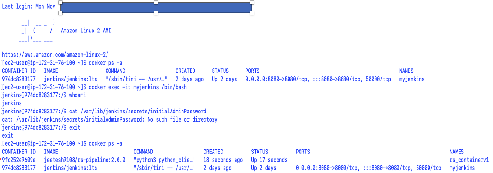{width="6.263888888888889in"
height="2.203472222222222in"}

> 13\. To verify the steps executed by the docker container, check the
> logs. Run,

*docker logs rs_containerv1 -f*

to see the log lines getting generated.

> 14\. The process will execute test cases, and print assertions result
> for values specified in
>
> the results section.
>
> 15\. Finally, log on to console Redshift clusters and you will a new
> cluster based on
>
> the cluster name provided in the clusterconfig.ini file.
>
> 16\. Once all the execution steps are completed, container will show a
> status of
>
> EXITED(0). You do not need to remove the stopped container, Jenkins
> pipeline
>
> automatically does that when starting.

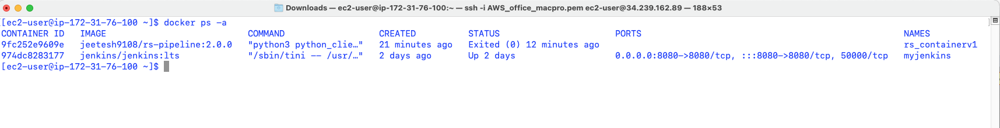{width="6.263888888888889in"
height="0.8069444444444445in"}

## Redshift CI/CD using AWS services 

This is the second model for enabling CI/CD on Redshift using AWS
managed services like Code Commit, Code Build and Code Deploy.

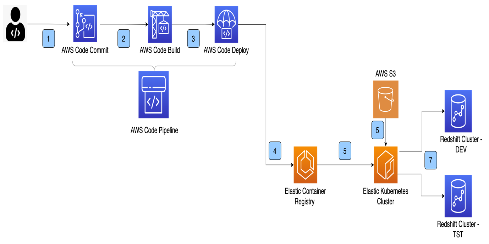{width="6.263888888888889in"
height="3.1368055555555556in"}

Event Flow

1.  A developer adds/modifies DDL/DML scripts in configuration files and
    commits changes into AWS code commit .

2.  AWS code commit triggers off a code build using configuration
    specified in buildspec.yml. The build happens based on pre_build,
    build and post_build command.

3.  AWS code builds the container image and pushes it to AWS code
    deploy.

4.  Code deploy pushes the container image to Elastic container Registry
    (ECR) repository.

5.  EKS cluster picks up the container image , reads configuration in s3
    bucket to determine execution step, connects with Redshift cluster
    and executes DDL/DML code.

6.  Code gets deployed in Redshift cluster environment, task completes
    and the deployment service waits for another change to DDL/DML
    script.

This section will implement the same CI/CD pipeline we reviewed but will
use AWS CI/CD services components. Below are the component details:

+-----------------+----------------------------------------------------+
| [AWS            | This is the version control system where you will  |
| Co              | be storing your code.                              |
| deCommit](https |                                                    |
| ://aws.amazon.c |                                                    |
| om/codecommit/) |                                                    |
+-----------------+----------------------------------------------------+
| [AWS            | This service will build and start the containers   |
| CodeBuild](http | to create environment and runtime components for   |
| s://aws.amazon. | code execution. The file \"buildspec.yml \"is used |
| com/codebuild/) | to build the container image                       |
|                 |                                                    |
|                 | -   **Prebuild:** Logs on to private repository on |
|                 |     AWS ECR (Elastic Container Repository), builds |
|                 |     an image based on the docker file specified.   |
|                 |                                                    |
|                 | -   **Build:** A base image of ubuntu 18.04 is     |
|                 |     pulled from the docker hub, Linux packages,    |
|                 |     python 3.7, AWS CLI are installed, and code    |
|                 |     from the repo is copied to the src directory   |
|                 |     of the container.                              |
|                 |                                                    |
|                 | -   **Post-build:** Docker image is pushed to the  |
|                 |     ECR repository and tagged as the latest image. |
+-----------------+----------------------------------------------------+
| AWS ECS         | A cluster is created using the AWS ECS service. A  |
|                 | task to deploy DDL runs as a service to deploy the |
|                 | DDL/DML and execute test cases. The task picks up  |
|                 | the latest image created by CodeBuild to deploy    |
|                 | the changes.                                       |
+-----------------+----------------------------------------------------+
| [AWS            | Responsible for the overall orchestration from     |
| CodePi          | source to Redshift cluster deployment              |
| peline](https:/ |                                                    |
| /aws.amazon.com |                                                    |
| /codepipeline/) |                                                    |
+-----------------+----------------------------------------------------+

As you can tell from the description of the different components above,
we\'re also using some additional dependencies at the code level; these
are as follows:

  ------------------ ----------------------------------------------------
  Pyunit             The open-source testing framework used to execute
                     test cases against the changes that have been
                     deployed on the Redshift cluster.

  ------------------ ----------------------------------------------------

In the succeeding sections, we will be diving deeper into how all of
these integrate.

## Push Code to the CodeCommit Repository

We will create a new repository, redshift_devops. Navigate to AWS
console\> codebuild\>create a repository and provide the name and
description on the create repository form.

{width="3.919708005249344in"
height="3.20244094488189in"}

Before you can push any code into this repo, you have to set up your Git
credentials follow the steps outlined in the [CodeCommit
documentation](https://docs.aws.amazon.com/codecommit/latest/userguide/setting-up-gc.html)
on how to do this. Once you reach Step 4, copy the HTTPS URL, and
instead of cloning, we would be adding the CodeCommit repo URL into the
code that we cloned earlier by doing the following steps:

git remote add code commit \<repo_https_url\>

git push code commit main

The last step will populate the repository, and you can confirm it by
refreshing the CodeCommit console. If you get prompted for username and
password, input the Git credentials you generated and downloaded from
Step 3.

## 

## AWS CodeBuild

Navigate to AWS console\> CodeBuild and select create build project.

1.  Project name as redshiftdevops.

2.  Description of the build project. Providing the following details:

> 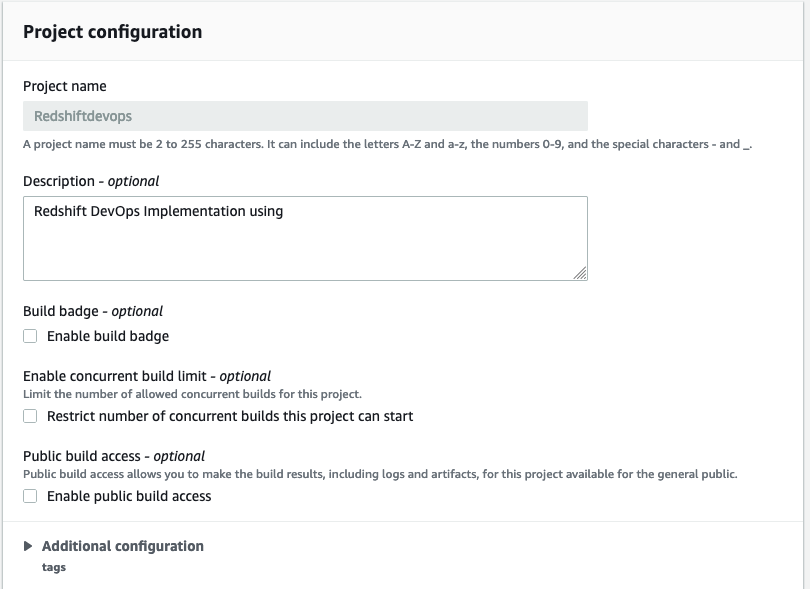{width="6.263888888888889in"
> height="4.554861111111111in"}

3.  Source -- on the drop-down, select AWS CodeCommit

The repository\'s name should be auto-populated; select the CodeBuild
repository created in the previous step. Select the branch as master

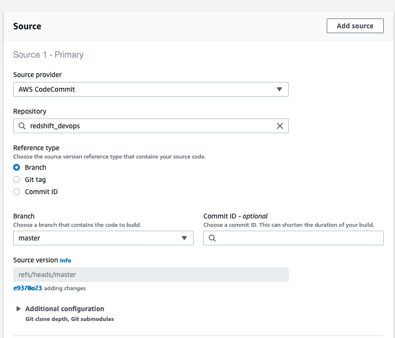{width="6.263888888888889in"
height="5.3590277777777775in"}

4.  Environment Image -- select managed image

The operating system as Ubuntu or Amazon Linux 2

Runtime -- standard

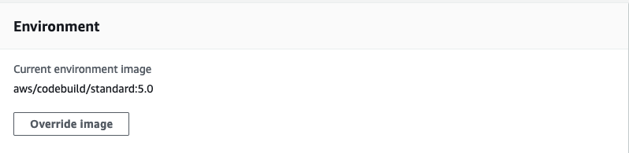{width="6.263888888888889in"
height="1.5305555555555554in"}

5.  Service role -- You can either create a new service role or select
    an existing service role you might have created. For IAM policy
    details, please refer to the
    [link](https://docs.aws.amazon.com/codebuild/latest/userguide/setting-up.html)

6.  BuildSpec file -- AWS CodeBuild uses the buildspec.yml file to
    perform the prebuild, buil,d and post-build steps. This file must be
    defined in the root directory of the CodeCommit repo. You can also
    define a custom name and location of the buildspec.yml file and
    provide the details.

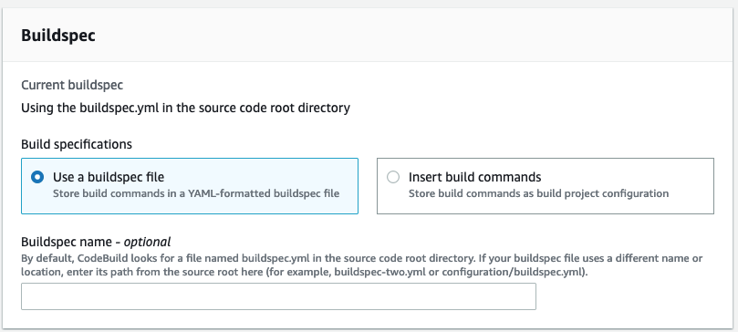{width="6.263888888888889in"
height="2.8180555555555555in"}

7.  Artifacts -- we will not generate any artifacts but upload the
    container image directly to ECR. Select the Type as No artifacts.

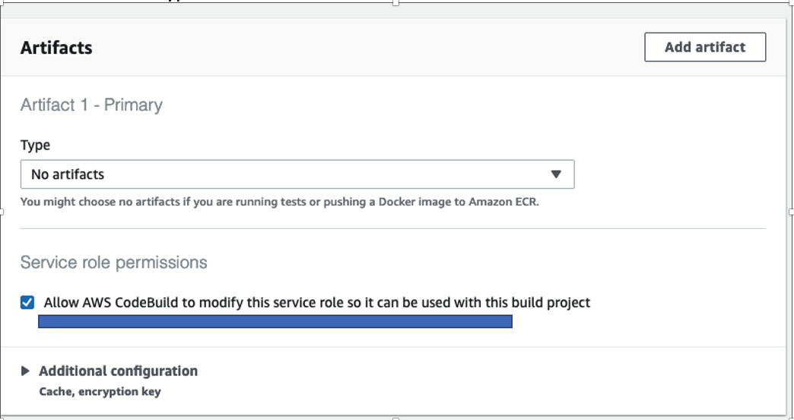{width="6.263888888888889in"
height="3.323611111111111in"}

8.  Logs -- Add a group name and stream name to capture the logs.

> 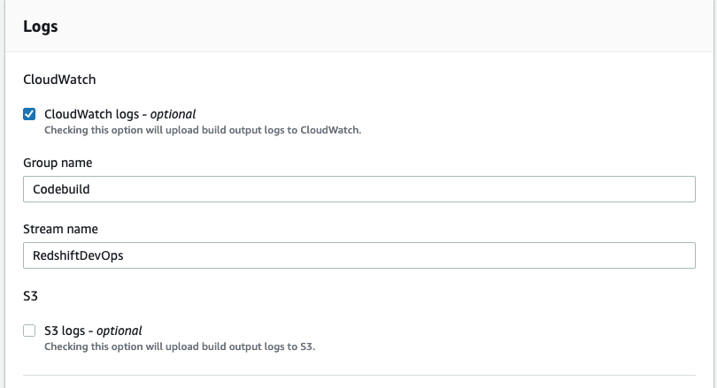{width="6.263888888888889in"
> height="3.395138888888889in"}

Once all the details have been provided, click the \"create build
project button.\"

## AWS Elastic Container Registry(ECR)

In the next step, we will create a private ECR repo to host the build
image created by the AWS Build service. Navigate to ECRAWS console \>
ECR.

Click create a repository, select the privacy setting as private and
provide a repository name.

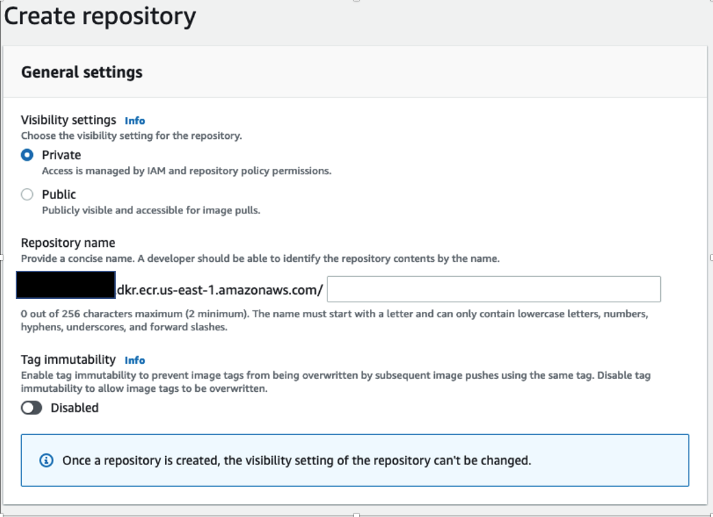{width="6.263888888888889in"
height="4.549305555555556in"}

Please note that visibility settings cannot be changed once an ECR
repository has been created.

## AWS Elastic Container Service (ECS)

From the AWS console, navigate to ECS (Elastic container service). Click
create cluster and select the option as \"Networking only,\" as we will
be using AWS Fargate to create and manage our cluster service. Click
next, provide cluster name and click create.

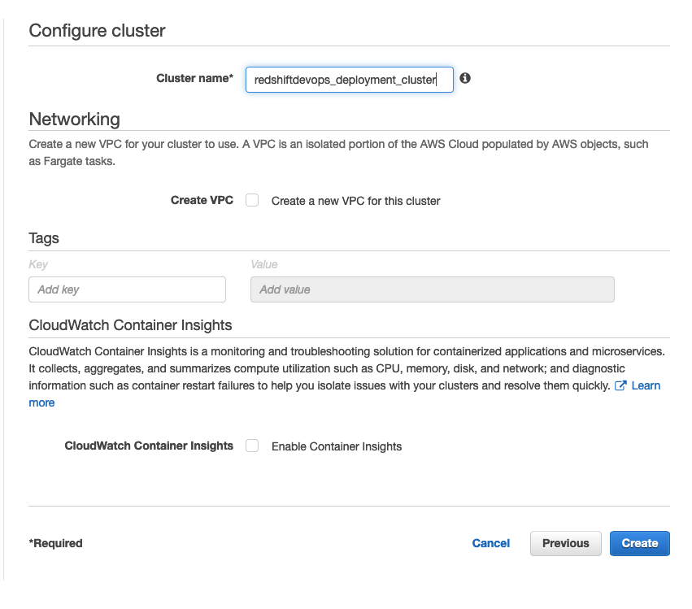{width="6.263888888888889in"
height="5.513194444444444in"}

Select Task Definitions click to create a new task definition on the
left-hand pane. On Launch type compatibility, select FARGATE and click
next. This will present the task and container definition screen.
Provide the following details:

1.  Task definition name -- Task name

2.  Task role -- The dropdown should provide ecsTaskExecutionRole

3.  Operating system family - Linux

4.  Task execution role -- ecsTaskExecutionRole

5.  Task memory -- 2 GB

6.  Task vCPU -- 1 vCPU

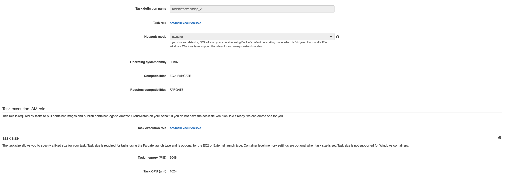{width="6.263888888888889in"
height="2.1590277777777778in"}

7.  Click Add Container, and it would present a new screen:

    a.  Container name -- Name of the container running the deployment
        pipeline

    b.  Image -- URI of the private ECS repo created

> *AWSACCOUNTNUMBER.dkr.ecr.us-east-1.amazonaws.com/redshiftdevops:redshiftdevops*

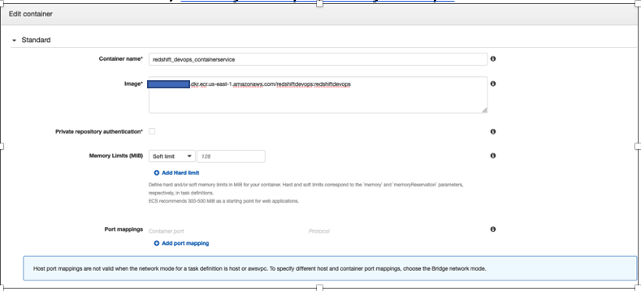{width="5.432071303587052in"
height="2.852905730533683in"}

c.  CPU Units - 1

d.  Environment -- Paste the following command:

> *python3,python_client_redshift_ephemeral.py,rollforward,query_redshift_api.ini,ALL,ALL,s,dw_config.ini,
> DEV*

{width="4.627933070866142in"
height="2.8008737970253716in"}

Leave the other parameter as blank and click create. This step completes
the ECS cluster and task definition needed to deploy changes to the
Redshift database.

8.  Select Task definitions on the left-hand pane, check box task
    created, click actions, and select deploy as a service.

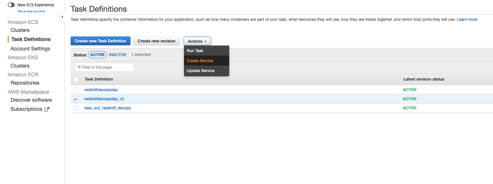{width="6.263888888888889in"
height="2.348611111111111in"}

This step created the task as a continuous service, which picks up
changes and deploys them to the Redshift cluster.

## AWS CodePipeline

To bring all of these components together, we will be using CodePipeline
to orchestrate the flow from source code until code deployment. There
are some additional capabilities you can do with CodePipeline. For
example, you can add an [Approval
step](https://docs.aws.amazon.com/codepipeline/latest/userguide/approvals-action-add.html)
after a code change is made for someone to review and perform a build
and deploy.

Navigate to CodePipeline from the console and click create the pipeline.
Our pipeline will consist of the Add source stage and Add build stage.
Provide a pipeline name and choose an existing or new IAM service to
deploy the change. Click Next

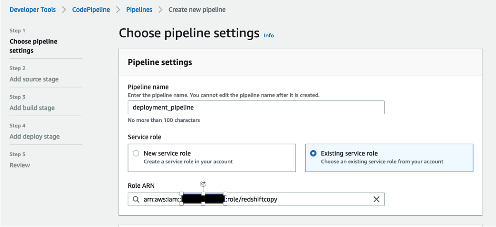{width="6.263888888888889in"
height="2.863888888888889in"}

Click Next and select source provider ad AWS CodeCommit. Select
repository name from the drop-down and Branch name as master.

# 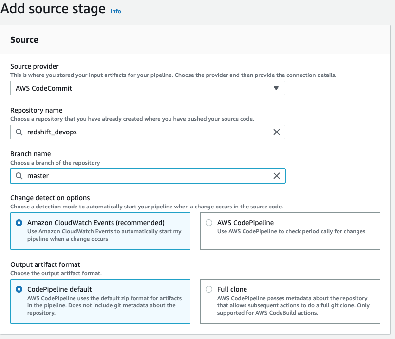{width="2.319377734033246in" height="1.990498687664042in"}

Add the build stage by selecting code provider as AWS CodeBuild, Region,
and Project name. Select Build type as Single Build. Click Next and
click skip deploy stage.

Review the changes and click create a pipeline; this should create the
pipeline needed.

# Example Scenario

Let\'s take an example scenario; we would add two new queries in the
redshift_query.ini file to execute on the existing Redshift cluster.
Copy the below lines towards the end of the file.

**\[DDL_v08\]\
query6** = **create table test_table_service(col1 varchar(10), col2
varchar(20));**

We will need to commit the changes by running the following commands on
terminal.

git add .

git commit -m \"changes to query.ini file.\"

git push

This should push the changes to the CodeCommit repository. AWS code
pipeline will trigger build job, create the docker image and push it to
AWS ECR.

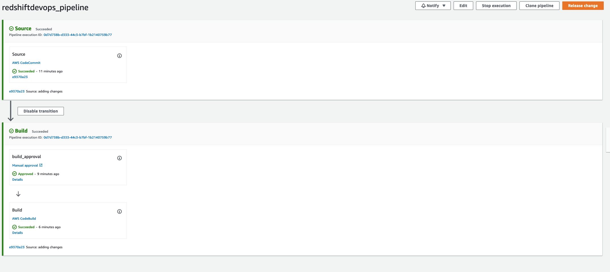{width="6.263888888888889in"
height="2.8041666666666667in"}

ECS service picks up all the changes and deploys them to Redshift, and
the table gets created.

# Conclusion

Using CI/CD principles in the context of Amazon Redshift stored
procedures, and schema changes improves the reliability and
repeatability of the change management process. Running test cases
validates database changes are providing expected output like
application code. If the test cases fail, changes can be backed out with
a simple rollback command.

In addition, versioning migrations enable consistency across multiple
environments and prevent issues arising from schema changes that are not
appropriately applied. This increases confidence when changes are made
and improves development velocity as teams spend more time developing
functionality rather than hunting for issues due to environmental
inconsistencies.
